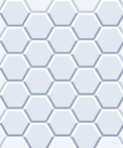

# Minesweeper Engine

[](https://www.npmjs.com/package/@maxxam0n/minesweeper-engine)
[](https://github.com/maxxam0n/minesweeper-engine/blob/main/LICENSE)

A lightweight, dependency-free, and platform-agnostic Minesweeper game engine written in TypeScript. It provides a clean API for game logic and state management, and includes built-in solvers for analyzing game states.

## ✨ Features

- **Clean Architecture**: Fully decoupled logic for the game board (`Field`), game rules (`MinesweeperEngine`), and AI analysis (`MinesweeperSolver`).
- **Immutable State Management**: Actions like `revealCell` or `toggleFlag` don't mutate the game state directly. Instead, they return the resulting state and an `apply` function, making it perfect for UI frameworks like React or Vue.
- **Isomorphic / Universal**: Zero dependencies on browser or Node.js APIs. Use it anywhere JavaScript runs.
- **Built-in Solver**: Includes a solver that can determine certain mines and safe cells, with a foundation for more advanced probabilistic analysis.
- **Classic 3BV Metrics**: Computes Bechtel's Board Benchmark Value (and 3BV-remaining) for a fully-mined field — the standard baseline for efficiency / IOE.
- **Multiple Field Types**: Support for square, hexagonal, and triangular field shapes.
- **No-guessing boards**: Generate layouts that are fully solvable by the built-in analyzer from a chosen start cell, with optional progress callbacks.
- **Testable**: Injectable Random Number Generator (RNG) allows for creating deterministic and easily testable game states.
- **Written in TypeScript**: Strong typing for a predictable and robust developer experience.

## Grid Schemes

### Hexagonal field (even-q vertical layout)

The hex grid is stored as a regular `rows x cols` array. Columns are aligned; even columns are shifted down by half a cell (even-q). Neighbor offsets depend on column parity:

```text
even col (col % 2 === 0)
(+1,0) (+1,-1) (0,-1) (-1,-1) (-1,0) (0,+1)

odd col (col % 2 === 1)
(+1,0) (0,-1) (-1,0) (-1,+1) (0,+1) (+1,+1)
```

Minimal layout sketch (rows increase downward, cols to the right):

```text
col: 0   1   2
r0:  o   o   o
r1:    o   o   o
r2:  o   o   o
```



### Triangular field (vertex-adjacent neighbors)

The grid is still stored as a `rows x cols` array. Orientation is based on parity: `(row + col) % 2 === 0` points up. Neighbors include any triangle that shares at least one vertex, so each cell can have up to 12 neighbors (3 edge + 9 vertex).

Edge neighbors by orientation:

- up (^): `(row - 1, col - 1)`, `(row - 1, col + 1)`, `(row + 1, col)`
- down (v): `(row + 1, col - 1)`, `(row + 1, col + 1)`, `(row - 1, col)`

Layout sketch:

```text
r0: /\  \/  /\  \/
r1: \/  /\  \/  /\
```


## 📦 Installation

```bash
npm install @maxxam0n/minesweeper-engine

yarn add @maxxam0n/minesweeper-engine

pnpm add @maxxam0n/minesweeper-engine
```

## 🚀 Basic Usage

Here's a quick example of how to create a game, perform an action, and get the updated state.

```typescript
import {
	GeometryFactory,
	MinesweeperEngine,
} from '@maxxam0n/minesweeper-engine'

const params = { rows: 10, cols: 10, mines: 15 }
const geometry = GeometryFactory.create({ type: 'square', params })

// 1. Create a new game engine instance (geometry is always required)
const engine = new MinesweeperEngine({ geometry, params })

console.log('Game started with status:', engine.gameSnapshot.status) // -> 'idle'

// 2. Perform an action (e.g., reveal a cell)
// This returns the result of the action without changing the engine's state yet.
const { data, apply } = engine.revealCell({ row: 5, col: 5 })

// `data.actionSnapshot` contains the full game state *if* the action is applied.
console.log('Hypothetical status after reveal:', data.actionSnapshot.status) // -> 'playing'

// `data.actionChanges` contains a delta of what will change.
// Useful for targeted UI updates and animations.
console.log(`Revealed ${data.actionChanges.revealedCells.length} cells.`)

// 3. Apply the action to commit the changes to the engine's state
apply()

// 4. Check the new state of the game
console.log('Actual game status:', engine.gameSnapshot.status) // -> 'playing'

// You can continue to make moves...
const flagResult = engine.toggleFlag({ row: 0, col: 0 })
flagResult.apply()

console.log(engine.gameSnapshot.flaggedCells.length) // -> 1
```

## API Reference

### `MinesweeperEngine`

The main class for managing the game flow. It does **not** generate solvable boards — pass a ready `data` grid when you need a fixed layout.

#### `new MinesweeperEngine(config)`

Creates a new game instance.

- `config`: `MineSweeperConfig`
   - `geometry`: **Required.** Built-in via `GeometryFactory.create({ type, params })` or classes `SquareGeometry` / `HexagonalGeometry` / `TriangularGeometry`, or your own `FieldGeometry`.
   - `params`: `GameParams` (`rows`, `cols`, `mines`). Requires integer `rows`/`cols` ≥ 5 and `0 ≤ mines ≤ floor(rows * cols * 0.5)`.
   - `data?`: Prebuilt field grid (`generateSolvableBoard`, `BoardEditor`, persist).
   - `rng?`: Optional RNG (`() => number`) for deterministic mine placement. Defaults to `Math.random`.
   - `maxHistory?`: Max undo stack size (default `100`). Use `0` to disable undo.

Throws `InvalidGameParamsError` when `params` fail validation.

#### `engine.revealCell(position)`

Generates an action to reveal a cell.

- `position`: `{ row: number, col: number }`
- Returns: `ActionResult`

**First-click opening.** On the first reveal the engine clears mines from the clicked cell and its neighbors (via `relocateMine` to a random safe cell outside that zone, using the engine `rng`), so the click is always an empty zero and opens an area through flood-fill. If there is nowhere to move those mines, the action results in a loss.

For boards from `generateSolvableBoard`, the first reveal **must** be the returned `startPos`. Solvability is guaranteed only from that cell; another first click can relocate mines and break the no-guessing layout. At `startPos` the opening is already a zero, so relocate is a no-op.

#### `engine.toggleFlag(position)`

Generates an action to toggle a flag on a cell.

- `position`: `{ row: number, col: number }`
- Returns: `ActionResult`

#### `engine.undo()` / `engine.canUndo`

`undo()` reverts the last committed `apply()` (field, status, flags). Returns `false` if history is empty.

#### `engine.onChange(listener)`

Subscribes to state updates after `apply` or `undo`. Returns an unsubscribe function.

```typescript
const off = engine.onChange(({ reason, snapshot, previousStatus }) => {
	console.log(reason, snapshot.status, previousStatus)
})
```

#### `engine.serialize()` / `GameEngine.fromPersistedState(state, options?)`

Persists `{ version, params, status, field }` (geometry is **not** embedded). Always pass `options.geometry` when restoring. Legacy snapshots that still include `type` can rebuild geometry via `GeometryFactory` if `options.geometry` is omitted.

#### `engine.gameSnapshot` (getter)

A getter that returns a complete snapshot of the current game state, including the field, cell lists, and game status.

### `generateSolvableBoard(config)`

Standalone generator (sync). Produces a closed mine layout that is fully solvable by the built-in analyzer from `startPos`. Run it on the main thread or inside your own Worker — then pass `data` into the engine.

```typescript
import {
	generateSolvableBoard,
	GeometryFactory,
	MinesweeperEngine,
} from '@maxxam0n/minesweeper-engine'

const params = { rows: 9, cols: 9, mines: 10 }
const geometry = GeometryFactory.create({ type: 'square', params })
const startPos = { row: 4, col: 4 }

const board = generateSolvableBoard({
	geometry,
	params,
	startPos,
	onProgress: ({ attempt, maxAttempts, phase }) => {
		console.log(phase, attempt, '/', maxAttempts)
	},
})

const engine = new MinesweeperEngine({
	geometry,
	params,
	data: board.data,
})

engine.revealCell(board.startPos).apply()
```

- `startPos`: required start cell (zero opening: cell + neighbors are mine-free). Call `revealCell(board.startPos)` first.
- `maxAttempts?`: sampling budget (default `500`).
- `createAnalyzer?`: override solvability oracle (defaults to built-in solver).
- `onProgress?`: `{ attempt, maxAttempts, phase: 'sample' | 'simulate' }`.

Throws `SolvableBoardGenerationError` if no solvable layout is found within `maxAttempts`. Also exported from `@maxxam0n/minesweeper-engine/solver`.

### `ActionResult`

The object returned by action methods. It follows a command pattern, allowing you to preview changes before applying them.

- `data`:
   - `actionSnapshot`: A full `GameSnapshot` of what the state will be _after_ the action is applied.
   - `actionChanges`: An `ActionChanges` object containing arrays of cells that were specifically affected by the action (e.g., `revealedCells`, `explodedCells`). This is ideal for fine-grained UI updates.
- `apply`: A function `() => void` that, when called, commits the action and updates the internal state of the `MinesweeperEngine` instance.

### `MinesweeperSolver`

A class for analyzing a game board to find guaranteed moves.

The solver uses **revealed numbers and mine-count constraints only**. It does **not** treat player flags as known mines: a flag can be wrong, and trusting it would corrupt the whole inference chain. Flags are a UI hint for the player, not ground truth for the solver.

```typescript
import {
	GeometryFactory,
	MinesweeperSolver,
} from '@maxxam0n/minesweeper-engine'

const gameParams = { rows: 10, cols: 10, mines: 15 }
const geometry = GeometryFactory.create({ type: 'square', params: gameParams })

const solver = new MinesweeperSolver({
	geometry,
	params: gameParams,
	data: engine.gameSnapshot.field,
})

const hints = solver.solve()
const safeMoves = hints.filter(h => h.value === 0)
console.log(`Found ${safeMoves.length} guaranteed safe moves.`)
```

### `MinesweeperIdealSolver`

Computes classic **3BV** (Bechtel's Board Benchmark Value) when the mine layout is already known in `data` (`isMine` populated — after the first reveal, or from a pre-generated field).

3BV is the minimum number of left clicks **without chording**: one click per opening + one click per numbered cell that does not touch an opening. Community efficiency / IOE is `3BV / clicks` (values above `1` require chords).

```typescript
import { MinesweeperIdealSolver } from '@maxxam0n/minesweeper-engine'

const ideal = new MinesweeperIdealSolver({
	geometry,
	params: gameParams,
	data: engine.gameSnapshot.field,
})

const { total, remaining } = ideal.getMetrics()
console.log(total) // 3BV from a pristine board
console.log(remaining) // 3BV-remaining from current progress

const ioe = MinesweeperIdealSolver.efficiency(total, playerClicks)
console.log(ioe) // e.g. 1.25 → 125% efficiency
```

### `BoardEditor`

Fluent builder for deterministic boards (puzzles, tutorials, tests). No RNG — mines and cell marks are set explicitly.

```typescript
import {
	BoardEditor,
	GeometryFactory,
	MinesweeperEngine,
} from '@maxxam0n/minesweeper-engine'

const params = { rows: 9, cols: 9, mines: 0 }
const geometry = GeometryFactory.create({ type: 'square', params })

const editor = BoardEditor.create({ geometry, params })
	.mine([
		{ row: 0, col: 0 },
		{ row: 2, col: 3 },
	])
	.reveal({ row: 4, col: 4 })
	.flag({ row: 0, col: 0 })

const engine = new MinesweeperEngine({
	geometry,
	params: editor.gameParams, // mines synced to placed count
	data: editor.build(),
})
```

Methods: `mine` / `unmine`, `reveal` / `cover`, `flag` / `unflag`, `clearMarks`, `build()` → `FieldGrid`, `buildField()` → `Field`.

## Subpath imports

```typescript
import {
	generateSolvableBoard,
	MinesweeperSolver,
} from '@maxxam0n/minesweeper-engine/solver'
import {
	GeometryFactory,
	SquareGeometry,
	HexagonalGeometry,
	TriangularGeometry,
} from '@maxxam0n/minesweeper-engine/geometry'
```

Built-in geometries are also re-exported from the main package entry.
## 💡 Advanced Usage

### Deterministic Games with a Seeded RNG

For testing or creating shareable game challenges, you can provide your own seeded RNG function.

```typescript
// You might need to install a library for this, e.g., `seedrandom`
// npm install seedrandom
import seedrandom from 'seedrandom'
import {
	GeometryFactory,
	MinesweeperEngine,
} from '@maxxam0n/minesweeper-engine'

const seed = 'my-secret-seed'
const deterministicRng = seedrandom(seed)
const params = { rows: 16, cols: 30, mines: 99 }
const geometry = GeometryFactory.create({ type: 'square', params })

const engine = new MinesweeperEngine({
	geometry,
	params,
	rng: deterministicRng,
})

// Every game created with this seed starts with the same mine layout.
// Note: the first click always forces a zero-opening (mines in the click
// neighborhood are relocated outside that zone), so the post-first-click
// board can differ from the initial seeded layout.
```
### Custom Geometry (odd-q hex example)

Implement `FieldGeometry` and pass it as `geometry` (same as built-ins).
The built-in `HexagonalGeometry` uses even-q vertical layout (even columns shifted down).
The opposite layout is odd-q: odd columns are shifted down.

```typescript
import type {
	FieldGeometry,
	GameParams,
	Position,
} from '@maxxam0n/minesweeper-engine'
import {
	MinesweeperEngine,
	MinesweeperSolver,
} from '@maxxam0n/minesweeper-engine'

class OddQHexagonalGeometry implements FieldGeometry {
	constructor(public readonly params: GameParams) {}

	public isInBoundary({ row, col }: Position): boolean {
		return (
			col >= 0 &&
			row >= 0 &&
			col < this.params.cols &&
			row < this.params.rows
		)
	}

	public getSiblings({ row, col }: Position): Position[] {
		const shiftedOffsets = [
			{ dx: +1, dy: 0 },
			{ dx: +1, dy: -1 },
			{ dx: 0, dy: -1 },
			{ dx: -1, dy: -1 },
			{ dx: -1, dy: 0 },
			{ dx: 0, dy: +1 },
		]

		const unshiftedOffsets = [
			{ dx: +1, dy: 0 },
			{ dx: 0, dy: -1 },
			{ dx: -1, dy: 0 },
			{ dx: -1, dy: +1 },
			{ dx: 0, dy: +1 },
			{ dx: +1, dy: +1 },
		]

		const offsets = col % 2 === 1 ? shiftedOffsets : unshiftedOffsets
		const siblings: Position[] = []

		for (const { dx, dy } of offsets) {
			const pos = { col: col + dx, row: row + dy }
			if (this.isInBoundary(pos)) siblings.push(pos)
		}

		return siblings
	}

	public getAllPositions(): Position[] {
		const result: Position[] = []
		for (let row = 0; row < this.params.rows; row++) {
			for (let col = 0; col < this.params.cols; col++) {
				const pos = { row, col }
				if (this.isInBoundary(pos)) result.push(pos)
			}
		}
		return result
	}
}

const params = { rows: 10, cols: 10, mines: 15 }
const geometry = new OddQHexagonalGeometry(params)

const engine = new MinesweeperEngine({
	geometry,
	params,
})

const solver = new MinesweeperSolver({
	geometry,
	params,
	data: engine.gameSnapshot.field,
})
```

## 🗺️ Roadmap

This project is actively maintained. Future plans include:

- [ ] **Advanced Solver Logic**: Implementing probabilistic models and set-based analysis for situations that require guessing.

## 🤝 Contributing

Contributions, issues, and feature requests are welcome! Feel free to check the [issues page](https://github.com/maxxam0n/minesweeper-engine/issues).

## 📄 License

This project is [MIT licensed](https://github.com/maxxam0n/minesweeper-engine/blob/main/LICENSE).
